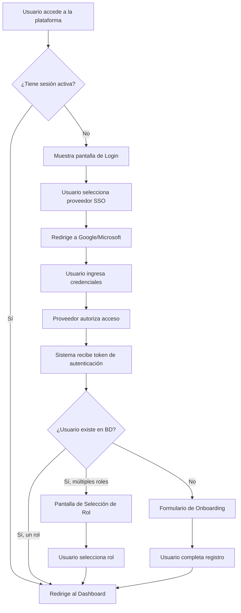
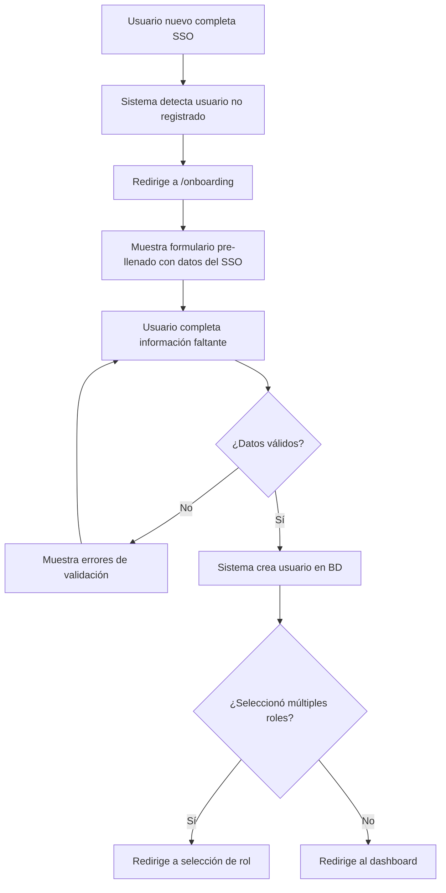
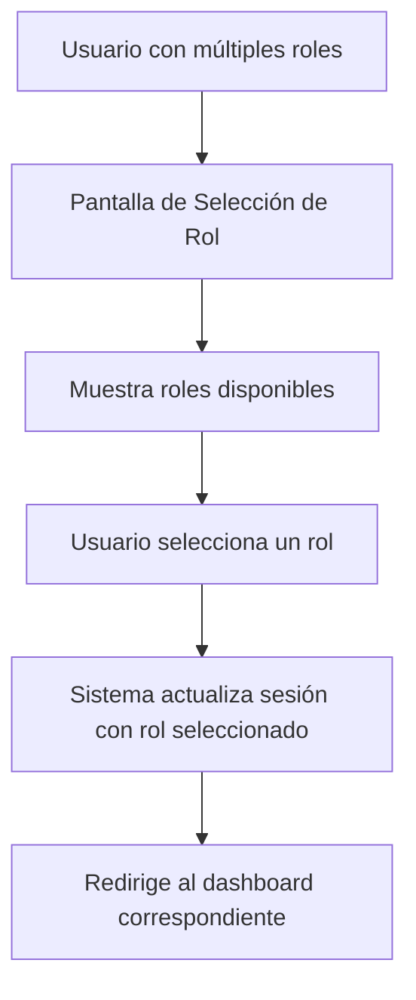
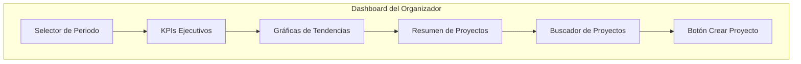
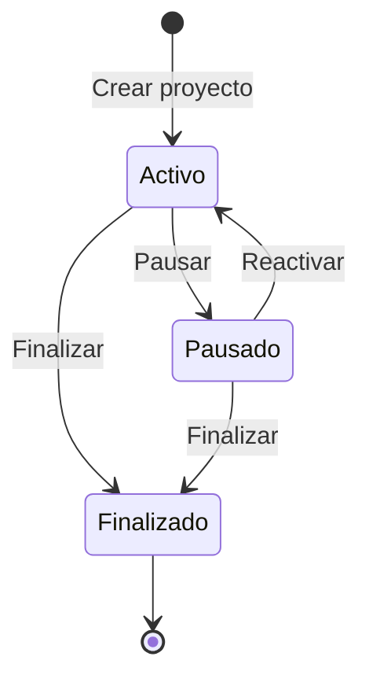
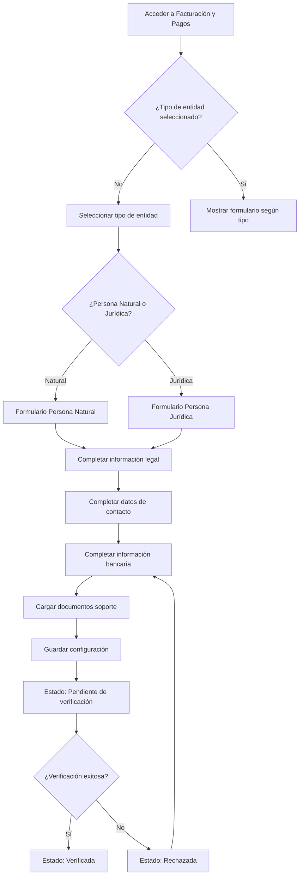
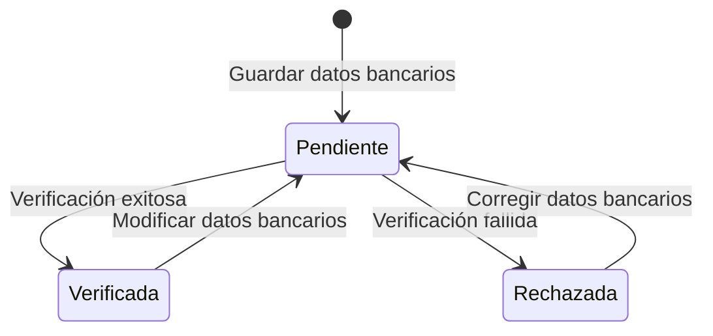

# Manual Funcional - GSSC Platform

## Índice

1. [Introducción](#introducción)
2. [Conceptos Básicos](#conceptos-básicos)
3. [Inicio de Sesión](#inicio-de-sesión)
4. [Registro de Usuarios](#registro-de-usuarios)
5. [Selección de Rol](#selección-de-rol)
6. [Roles y Permisos](#roles-y-permisos)
7. [Dashboard del Organizador](#dashboard-del-organizador)
8. [Gestión de Proyectos](#gestión-de-proyectos)
9. [Configuración de Facturación y Pagos](#configuración-de-facturación-y-pagos)
10. [Sistema de Errores](#sistema-de-errores)
11. [Navegación](#navegación)
12. [Cerrar Sesión](#cerrar-sesión)
13. [Preguntas Frecuentes](#preguntas-frecuentes)

---

## Introducción

GSSC (Glamur Supply Chain Control) es una plataforma de gestión colaborativa que conecta tres tipos de usuarios diferentes:

- **Organizadores**: Gestionan proyectos, coordinan el trabajo y reciben comisiones por las ventas
- **Proveedores**: Ejecutan servicios y gestionan clientes
- **Compradores**: Realizan compras y seguimiento de sus pedidos

Cada rol accede a la plataforma con un proveedor de autenticación diferente para mantener la seguridad y separación de responsabilidades.

---

## Conceptos Básicos

### ¿Qué es Single Sign-On (SSO)?

SSO permite iniciar sesión usando tu cuenta existente de Google o Microsoft, sin necesidad de crear una nueva contraseña. Es más seguro y conveniente.

### Roles del Sistema

| Rol | Descripción | Dashboard Principal |
|-----|-------------|---------------------|
| **Organizador** | Gestiona proyectos y recibe comisiones por ventas | `/dashboard` |
| **Proveedor** | Ejecuta servicios y gestiona clientes | `/customer-dash` |
| **Comprador** | Realiza compras y consulta historial | `/product/{id}` |

### Glosario de Términos

| Término | Definición |
|---------|------------|
| **Comisión del organizador** | Porcentaje de ganancia que recibe el organizador por las ventas de sus proyectos |
| **Proyecto** | Unidad de negocio que agrupa pedidos, productos y genera comisiones |
| **Persona Natural** | Individuo que actúa a título personal, identificado con cédula |
| **Persona Jurídica** | Empresa legalmente constituida, identificada con NIT y RUT |
| **Verificación de cuenta** | Proceso de validación de que la cuenta bancaria pertenece al usuario |
| **Onboarding** | Proceso de registro inicial para nuevos usuarios |

---

## Inicio de Sesión

### Proceso de Autenticación

El sistema utiliza autenticación federada (SSO) con Google y Microsoft. El flujo completo se describe a continuación:

### Pasos para Iniciar Sesión

1. Accede a la URL de la plataforma
2. Selecciona tu método de autenticación (Google o Microsoft)
3. Ingresa tus credenciales en la página del proveedor
4. Autoriza el acceso a la plataforma
5. El sistema te redirigirá automáticamente según tu situación:
   - **Usuario existente con un rol**: Directo al dashboard
   - **Usuario existente con múltiples roles**: Pantalla de selección de rol
   - **Usuario nuevo**: Formulario de onboarding

### Pantalla de Procesamiento

Después de autenticarte, verás una pantalla de procesamiento con:
- Indicador de progreso animado
- Mensaje: "Completando autenticación"
- Mensaje: "Procesando tu información..."
- Mensaje: "¡Autenticación exitosa! Redirigiendo..."

---

## Registro de Usuarios

### Proceso de Onboarding

Cuando un usuario nuevo inicia sesión por primera vez, el sistema lo redirige al formulario de onboarding para completar su registro.

### Información Requerida en el Registro

| Campo | Obligatorio | Descripción |
|-------|-------------|-------------|
| Nombre completo | Sí | Mínimo 3 caracteres |
| Teléfono celular | Sí | Formato internacional (+57...) |
| Ciudad | Sí | Mínimo 2 caracteres |
| Departamento/Estado | Sí | Mínimo 2 caracteres |
| País | Sí | Por defecto: Colombia |
| Dirección | Sí | Mínimo 10 caracteres |
| Información adicional | No | Apartamento, edificio, etc. |
| Rol | Sí | Comprador (por defecto) u Organizador |

### Roles Disponibles en el Registro

- **Comprador (buyer)**: Rol por defecto, permite realizar compras
- **Organizador (organizer)**: Permite gestionar proyectos y recibir comisiones
- El rol de **Proveedor (supplier)** solo se asigna internamente

### Cancelación del Registro

Si decides cancelar el proceso de registro:
1. Haz clic en el botón "Cancelar"
2. Confirma en el diálogo que aparece
3. Tu sesión se cerrará y volverás a la página de inicio

---

## Selección de Rol

### ¿Cuándo se muestra esta pantalla?

La pantalla de selección de rol aparece cuando:
- Un usuario existente tiene múltiples roles asignados
- Un usuario nuevo se registra con más de un rol

### Proceso de Selección

1. Se muestran todos los roles disponibles para tu cuenta
2. Selecciona el rol con el que deseas trabajar
3. Haz clic en "Continuar"
4. Serás redirigido al dashboard correspondiente al rol seleccionado

**Nota:** Si necesitas cambiar de rol, deberás cerrar sesión e iniciar nuevamente.

---

## Roles y Permisos

### Organizador

**Dashboard Principal:** `/dashboard`

**Funcionalidades:**
- Vista ejecutiva de todos sus proyectos
- Métricas de comisiones generadas
- Gestión de proyectos
- Configuración de facturación y pagos
- Creación de nuevos proyectos

**Menú de Navegación:**
- 🏠 **Dashboard**: Vista general de proyectos y métricas
- 📁 **Proyectos**: Gestión de proyectos activos
- 💳 **Pagos**: Control de transacciones y facturación
- ⚙️ **Configuración**: Ajustes de cuenta, facturación y pagos

### Proveedor

**Dashboard Principal:** `/customer-dash`

**Funcionalidades:**
- Gestión de clientes asignados
- Seguimiento de proyectos
- Calendario de actividades

**Menú de Navegación:**
- 🏠 **Dashboard**: Vista general de clientes y servicios
- 📁 **Proyectos**: Proyectos asignados
- 👥 **Clientes**: Gestión de cartera de clientes
- 📅 **Calendario**: Agenda y planificación

### Comprador

**Dashboard Principal:** `/product/{id}`

**Funcionalidades:**
- Consulta de productos
- Historial de compras
- Seguimiento de pedidos

**Menú de Navegación:**
- 📜 **Historial**: Registro de transacciones y compras

---

## Dashboard del Organizador

### Propósito

El Dashboard del Organizador es la pantalla principal para usuarios con rol organizador. Proporciona una **vista ejecutiva y consolidada** del desempeño de todos los proyectos, permitiendo tomar decisiones estratégicas basadas en métricas agregadas.

### Estructura del Dashboard

### KPIs Ejecutivos

El dashboard muestra las siguientes métricas clave:

| KPI | Descripción |
|-----|-------------|
| **Comisión generada** | Valor monetario de la comisión del organizador (nunca ventas brutas) |
| **Pedidos totales** | Cantidad total de pedidos en todos los proyectos |
| **Pedidos completados** | Pedidos entregados exitosamente |
| **Pedidos en proceso** | Pedidos aún no completados |
| **Productos vendidos** | Total de unidades vendidas |

**Importante:** Los valores monetarios mostrados corresponden **exclusivamente** a la comisión del organizador, nunca a ventas brutas o ingresos totales.

### Filtros Temporales

Puedes analizar las métricas por diferentes periodos:

| Periodo | Descripción |
|---------|-------------|
| **Mensual** | Datos del mes actual (selección por defecto) |
| **Trimestral** | Datos de los últimos 3 meses |
| **Semestral** | Datos de los últimos 6 meses |

**Nota:** No se permite análisis diario u operacional desde este dashboard.

### Gráficas de Tendencias

El dashboard incluye tres visualizaciones principales:

1. **Evolución de Comisión**
   - Muestra la comisión generada a lo largo del tiempo
   - Agrupación según el periodo seleccionado

2. **Estado de Pedidos**
   - Distribución de pedidos por estado
   - Completados vs En proceso

3. **Productos Más Vendidos**
   - Ranking de productos por unidades vendidas
   - Sin valores monetarios

**Nota:** Las gráficas son informativas y no interactivas (no permiten drill-down).

### Resumen de Proyectos

Para cada proyecto se muestra:
- Nombre del proyecto
- Estado (activo, pausado, finalizado)
- Cantidad de pedidos
- Unidades vendidas
- Comisión generada

### Búsqueda de Proyectos

El buscador permite filtrar proyectos por:
- **Nombre** del proyecto
- **Estado** (activo, pausado, finalizado)

**Limitaciones:** No permite buscar productos, pedidos ni compradores.

### Creación de Proyectos

El botón "Crear nuevo proyecto" es la única acción primaria disponible en el dashboard. Al hacer clic, se inicia el flujo de creación de un nuevo proyecto.

### Estados de Proyectos

| Estado | Descripción |
|--------|-------------|
| **Activo** | Proyecto operando normalmente, genera pedidos y comisiones |
| **Pausado** | Proyecto temporalmente detenido, no genera nuevos pedidos |
| **Finalizado** | Proyecto cerrado definitivamente, solo consulta histórica |

---

## Gestión de Proyectos

### Propósito

El módulo de Gestión de Proyectos permite a los Organizadores crear y configurar proyectos que agrupan productos (uniformes, accesorios, souvenirs) para su venta a través de la plataforma Glam Urban.

Un proyecto es la unidad principal de negocio donde el organizador define la configuración económica, logística y de entrega de los productos que pondrá a la venta.

### Acceso al Módulo

**Ubicación:** 
- Crear proyecto: Dashboard → Botón "Crear nuevo proyecto" (`/project/new`)
- Editar proyecto: Dashboard → Seleccionar proyecto → Editar (`/project/{id}/edit`)

### Crear un Nuevo Proyecto

#### Información Básica

| Campo | Obligatorio | Descripción |
|-------|-------------|-------------|
| **Nombre del proyecto** | Sí | Nombre único en toda la plataforma. Solo letras, números y espacios. Máximo 100 caracteres. **No se puede modificar después de la creación.** |
| **Tipo de proyecto** | Sí | Categoría del proyecto: Equipo, Institución, Empresa, Grupo u Otro |
| **Descripción corta** | No | Texto informativo para la tienda pública. Máximo 500 caracteres |
| **Logo del proyecto** | No | Imagen PNG, JPG o WebP. Máximo 2MB. Si excede el tamaño, se comprime automáticamente. Si no se carga, se asigna un avatar por defecto |

#### Configuración Económica

| Campo | Obligatorio | Descripción |
|-------|-------------|-------------|
| **Comisión del organizador** | Sí | Porcentaje de ganancia sobre cada venta (0-100%). Debe ser un número entero. Aplica a todos los productos del proyecto |

**Importante:** Al modificar la comisión en un proyecto con productos, el sistema muestra una advertencia indicando que el cambio afectará el precio de todos los productos.

#### Packaging Personalizado

| Opción | Descripción |
|--------|-------------|
| **Sí** | Los productos se empaquetan con branding del proyecto. Afecta el costo y precio publicado |
| **No** | Empaquetado estándar |

**Nota:** El cambio de packaging solo aplica a nuevos productos. Los productos existentes mantienen su configuración actual.

#### Modos de Entrega

El proyecto debe tener **al menos un modo de entrega activo** para poder activarse. Puedes habilitar uno o varios de los siguientes:

**1. Entrega en sede del organizador**

| Campo | Obligatorio | Descripción |
|-------|-------------|-------------|
| Dirección de entrega | Sí (si habilitado) | Ubicación donde se entregarán los productos |
| Periodicidad | Sí (si habilitado) | Frecuencia de entrega: Semanal, Quincenal, Mensual o Lo más pronto posible |

**2. Entrega a domicilio del comprador**

| Opción | Descripción |
|--------|-------------|
| Se cobra el domicilio al cliente | El costo del envío se calcula según la ubicación del comprador |
| Entrega gratis | El costo está incluido en el precio del producto. Reduce la ganancia del organizador |

**3. Recolección en Glam Urban**

Sin costo adicional. El organizador recoge los productos directamente en las instalaciones de Glam Urban.

#### Estado del Proyecto

Al crear un proyecto, puedes seleccionar el estado inicial:

| Estado | Descripción |
|--------|-------------|
| **Borrador** | Estado por defecto. El proyecto no es visible públicamente. Permite configurar sin publicar |
| **Activo** | El proyecto es visible en la tienda pública y acepta pedidos. Requiere que toda la información obligatoria esté completa |

### Estados y Transiciones

Los proyectos pueden estar en uno de los siguientes estados:

| Estado | Descripción | Acciones disponibles |
|--------|-------------|---------------------|
| **Borrador** | Proyecto en configuración, no visible públicamente | Activar |
| **Activo** | Proyecto visible en tienda pública, acepta pedidos | Pausar, Finalizar |
| **Pausado** | Proyecto no acepta nuevos pedidos, procesa los existentes | Reactivar, Finalizar |
| **Finalizado** | Proyecto cerrado permanentemente | Ninguna (estado terminal) |

**Reglas de transición:**
- Un proyecto en **Borrador** solo puede pasar a **Activo** (si cumple todos los requisitos)
- Un proyecto **Activo** puede **Pausarse** o **Finalizarse**
- Un proyecto **Pausado** puede **Reactivarse** o **Finalizarse**
- Un proyecto **Finalizado** no puede volver a activarse

**Pausar un proyecto con pedidos activos:**
Al pausar un proyecto que tiene pedidos en curso, el sistema muestra una advertencia. Los pedidos existentes continuarán su proceso normal de entrega, pero no se aceptarán nuevos pedidos.

### Editar un Proyecto

Al editar un proyecto existente:

- El **nombre del proyecto** no puede modificarse (aparece bloqueado)
- Los cambios en **comisión**, **packaging** o **modos de entrega** muestran advertencias sobre el impacto en productos y pedidos
- Los pedidos existentes **nunca** se ven afectados por los cambios de configuración

### Cancelar Creación o Edición

- Si hay cambios sin guardar, el sistema solicita confirmación antes de salir
- Si no hay cambios, se redirige directamente al dashboard

### Validaciones

El sistema valida automáticamente:

| Validación | Mensaje de error |
|------------|------------------|
| Nombre vacío | "El nombre del proyecto es obligatorio" |
| Nombre con caracteres especiales | "El nombre solo puede contener letras, números y espacios" |
| Nombre mayor a 100 caracteres | "El nombre no puede exceder 100 caracteres" |
| Nombre duplicado | "El nombre del proyecto ya existe" |
| Comisión no entero | "La comisión debe ser un número entero" |
| Comisión fuera de rango | "La comisión debe ser un valor entre 0 y 100" |
| Activar sin modo de entrega | "Debe seleccionar al menos un modo de entrega para activar el proyecto" |
| Activar sin comisión | "Debe definir la comisión para activar el proyecto" |

---

## Configuración de Facturación y Pagos

### Propósito

Este módulo permite a los Organizadores configurar su información legal, de contacto y bancaria para poder recibir pagos por las ventas realizadas en la plataforma.

**Ubicación:** Configuración → Facturación y Pagos (`/settings/billing`)

### Flujo de Configuración

### Tipo de Entidad

Al configurar la facturación por primera vez, debes seleccionar tu tipo de entidad:

| Tipo | Descripción | Documentos Requeridos |
|------|-------------|----------------------|
| **Persona Natural** | Individuo que actúa a título personal | Cédula de ciudadanía |
| **Persona Jurídica** | Empresa legalmente constituida | RUT |

**Importante:** El tipo de entidad solo puede seleccionarse una vez. Cambios posteriores requieren contactar a Soporte.

### Información Legal - Persona Natural

| Campo | Obligatorio | Descripción |
|-------|-------------|-------------|
| Nombre completo | Sí | Nombre legal completo |
| Tipo de documento | Sí | Cédula de ciudadanía o extranjería |
| Número de documento | Sí | Número del documento de identidad |
| Dirección fiscal | Sí | Dirección oficial para efectos tributarios |
| Copia de cédula | Sí | Archivo PDF, JPG o PNG |

**Autocompletado:** Si eres Persona Natural, puedes usar la opción "Usar los mismos datos de mi perfil de registro" para pre-llenar algunos campos. Los datos autocompletados son editables.

### Información Legal - Persona Jurídica

| Campo | Obligatorio | Descripción |
|-------|-------------|-------------|
| Razón social | Sí | Nombre legal de la empresa |
| NIT | Sí | Número de Identificación Tributaria |
| Dirección fiscal | Sí | Dirección oficial de la empresa |
| RUT | Sí | Registro Único Tributario (solo PDF) |

### Datos de Contacto

| Campo | Obligatorio | Descripción |
|-------|-------------|-------------|
| Email de contacto financiero | Sí | Para comunicaciones sobre pagos |
| Teléfono principal | Sí | Número de contacto |
| Dirección completa | Sí | Dirección física de contacto |

### Información Bancaria

| Campo | Obligatorio | Descripción |
|-------|-------------|-------------|
| Titular de la cuenta | Sí | Nombre del titular |
| Banco o proveedor | Sí | Institución financiera |
| Tipo de cuenta | Sí | Ahorros, Corriente o Billetera digital |
| Número de cuenta | Sí | Número de la cuenta bancaria |
| Certificación bancaria | Sí | Documento del banco (PDF, JPG o PNG) |

### Estados de Verificación

| Estado | Color | Descripción |
|--------|-------|-------------|
| **Pendiente** | 🟡 Amarillo | Cuenta en proceso de verificación. No se pueden recibir transferencias. |
| **Verificada** | 🟢 Verde | Cuenta validada. Se pueden recibir transferencias. |
| **Rechazada** | 🔴 Rojo | Verificación fallida. Se requiere corrección de datos. |

**Importante:** 
- Al guardar o modificar datos bancarios, el estado vuelve a "Pendiente"
- No se pueden realizar transferencias mientras el estado sea diferente a "Verificada"

---

## Sistema de Errores

### Propósito

Cuando ocurre un error en la plataforma, el sistema muestra una página de error con un código de referencia. Este código permite al equipo de soporte identificar rápidamente la causa del problema.

### Página de Error

Cuando algo falla, verás:
- Un mensaje amigable: "Oops! Tenemos un error"
- Un código de referencia (ej: `AUTH-NET-001`)
- Un botón para volver al inicio

### Códigos de Error Comunes

| Código | Situación | Qué hacer |
|--------|-----------|-----------|
| `AUTH-SSO-001` | Error del proveedor de autenticación | Intentar nuevamente el login |
| `AUTH-SSO-002` | No se recibió autorización | Intentar nuevamente el login |
| `AUTH-SSO-003` | Problema con cookies del navegador | Verificar que las cookies estén habilitadas |
| `AUTH-TKN-001` | Error al procesar autenticación | Contactar a soporte si persiste |
| `REG-NET-001` | Error de conexión al registrar | Verificar conexión a internet e intentar nuevamente |
| `REG-DUP-001` | Email ya registrado | Iniciar sesión con la cuenta existente |
| `SES-EXP-001` | Sesión expirada | Iniciar sesión nuevamente |
| `NAV-NTF-001` | Página no encontrada | Verificar la URL o volver al inicio |

### Cómo Reportar un Error

1. Anota el código de error que aparece en pantalla
2. Haz clic en el código para copiarlo al portapapeles
3. Contacta a soporte incluyendo:
   - El código de error
   - Qué estabas haciendo cuando ocurrió
   - Tu navegador y dispositivo

---

## Navegación

### Barra Lateral (Sidebar)

La barra de navegación lateral está disponible en todas las pantallas después del login.

**Características:**
- **Collapsible**: Haz clic en el icono de flecha para contraer/expandir
- **Iconos visuales**: Cada sección tiene un icono distintivo
- **Menú dinámico**: Solo muestra las opciones relevantes para tu rol
- **Avatar de usuario**: Muestra tu foto de perfil y nombre

### Estados de la Sidebar

| Estado | Ancho | Muestra |
|--------|-------|---------|
| **Expandida** | 256px | Icono + Texto + Avatar completo |
| **Contraída** | 80px | Solo iconos + Avatar reducido |

### Información de Usuario

En la parte inferior de la sidebar:
- Avatar circular con tu foto de perfil
- Nombre completo
- Rol asignado
- Menú desplegable con opción de cerrar sesión

---

## Cerrar Sesión

### Cómo Cerrar Sesión

1. Haz clic en tu avatar en la parte inferior de la sidebar
2. Selecciona "Cerrar sesión" en el menú desplegable
3. Serás redirigido automáticamente a la página de login

### Proceso de Cierre

Al cerrar sesión, el sistema automáticamente:
- ✅ Elimina tu sesión del servidor
- ✅ Borra las cookies de autenticación
- ✅ Limpia datos locales del navegador
- ✅ Invalida tu token de sesión

### Cierre Automático de Sesión

Tu sesión expirará automáticamente después de un periodo de inactividad. Cuando esto ocurra, serás redirigido automáticamente al login.

---

## Preguntas Frecuentes

### Autenticación

**¿Por qué tengo que usar Google o Microsoft?**

La plataforma usa autenticación federada (SSO) para:
- **Seguridad**: No necesitas crear otra contraseña
- **Conveniencia**: Usa tu cuenta existente
- **Auditoría**: Mejor trazabilidad de accesos

**¿La plataforma guarda mi contraseña?**

No. La plataforma **nunca** ve ni guarda tu contraseña. La autenticación la maneja directamente Google o Microsoft.

**¿Qué información puede ver la plataforma de mi cuenta?**

Solo accedemos a:
- ✅ Tu nombre completo
- ✅ Tu dirección de email
- ✅ Tu foto de perfil
- ❌ NO accedemos a tus emails, archivos o contactos

### Roles y Acceso

**¿Puedo tener múltiples roles?**

Sí. Si tienes múltiples roles, al iniciar sesión verás una pantalla para seleccionar con qué rol deseas trabajar.

**¿Puedo cambiar mi rol durante la sesión?**

No. Para cambiar de rol, debes cerrar sesión e iniciar nuevamente, seleccionando el rol deseado.

### Facturación

**¿Por qué necesito verificar mi cuenta bancaria?**

La verificación protege contra fraudes y errores, asegurando que los pagos lleguen al titular correcto.

**¿Cuánto tiempo tarda la verificación?**

El proceso de verificación puede tomar entre 1 a 3 días hábiles.

**¿Puedo cambiar mi tipo de entidad después de configurarlo?**

No directamente. Cambios en el tipo de entidad requieren contactar a Soporte.

### Problemas Técnicos

**¿Qué hago si veo un código de error?**

1. Anota el código que aparece
2. Intenta la acción nuevamente
3. Si persiste, contacta a soporte con el código

**¿Qué navegadores son compatibles?**

- ✅ Google Chrome 90+
- ✅ Microsoft Edge 90+
- ✅ Firefox 88+
- ✅ Safari 14+

**¿La plataforma funciona en móvil?**

Sí. La plataforma es responsive y funciona en teléfonos, tablets, laptops y desktops.

---

## Glosario

| Término | Definición |
|---------|------------|
| **SSO (Single Sign-On)** | Sistema que permite usar una sola identidad para acceder a múltiples aplicaciones |
| **OAuth 2.0** | Protocolo estándar de autorización para aplicaciones web |
| **Dashboard** | Página principal personalizada según tu rol |
| **Rol** | Tipo de usuario que determina tus permisos y accesos |
| **Onboarding** | Proceso de registro inicial para nuevos usuarios |
| **KPI** | Indicador clave de rendimiento (Key Performance Indicator) |
| **Comisión** | Porcentaje de ganancia del organizador por ventas |
| **Verificación** | Proceso de validación de cuenta bancaria |

---

## Soporte

Para asistencia adicional:
- 📧 Email: soporte@glamur-ssc.com
- 📞 Teléfono: [número de soporte]
- 💬 Chat: Disponible en la plataforma (próximamente)

**Horario de atención:**
- Lunes a Viernes: 9:00 AM - 6:00 PM
- Sábados: 9:00 AM - 2:00 PM
- Domingos: Cerrado

---

_Última actualización: Diciembre 2024_
_Versión: 2.1_
