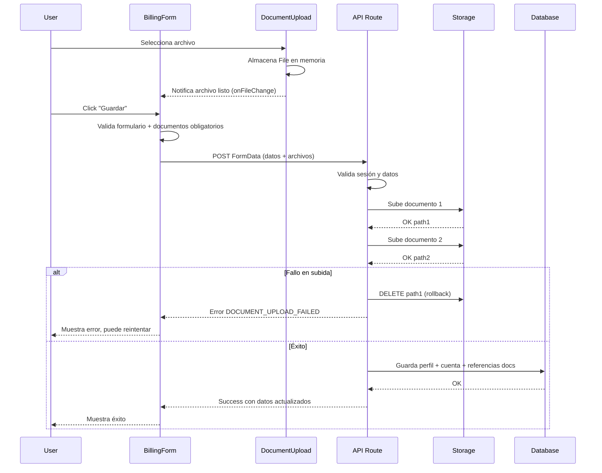

# Plan de Implementación – Configuración de Facturación y Pagos

> **Rol del documento**  
> Este archivo es el **contrato operativo** entre el humano y la(s) AI Agent(s).  
> La AI **NO debe escribir código** hasta que este plan esté completo, validado y aprobado.

---

## 1. Contexto

### 1.1 Referencias obligatorias
- Documento técnico principal: `DOCS_TECHNICAL.md`
- Especificación funcional: `specs/settings/provider/billing/spec.md`
- Descripción funcional: `specs/settings/provider/billing/dec-funcional.md`
- Ejemplos cURL backend: `specs/settings/provider/billing/global-setting-curl.md`

### 1.2 Objetivo del plan
Actualizar el módulo de **Configuración de Facturación y Pagos** para integrar con el backend real de Supabase, reemplazando los mocks actuales. El módulo permite a los Organizers registrar su información legal, de contacto y bancaria para poder recibir pagos.

**Cambio importante (v2.1):** Los documentos ahora se envían junto con el formulario al finalizar (no inmediatamente al seleccionarlos). El BFF procesa todo atómicamente con rollback en caso de error.

**Cambio importante (v2.2):** Nuevo modelo de cuentas bancarias:
- `is_active`: Indica si la cuenta está habilitada (puede tener múltiples activas)
- `is_preferred`: Indica la cuenta seleccionada para recibir pagos (solo una, requiere verified + active)
- Eliminado campo `holder_name` de cuentas bancarias
- Lista de cuentas con radio buttons para selección de preferida
- No se pueden eliminar cuentas, solo inactivar
- No se puede inactivar la cuenta preferida

**Cambio importante (v2.3):** Ajuste en creación de cuentas bancarias:
- Todas las cuentas se crean con `is_active: true` por defecto
- ~~La primera cuenta del usuario se marca como `is_preferred: true` inmediatamente (sin esperar verificación)~~ **OBSOLETO**

**Cambio importante (v2.4):** Las cuentas ya NO se marcan como preferidas automáticamente:
- Las cuentas se crean con `is_active: true` pero `is_preferred: false`
- El usuario debe seleccionar manualmente la cuenta preferida después de que sea verificada
- Ni siquiera la primera cuenta se marca como preferida automáticamente

**Cambio importante (v2.5/v2.6):** Simplificación de UX:
- Después de guardar la configuración exitosamente, se redirige al dashboard (`/dashboard`)
- Autocompletado automático sin opción manual: si no existe perfil de facturación, se autocompletan datos desde perfil de registro en la inicialización del estado
- Si ya existe perfil de facturación guardado, se cargan los datos del servicio
- Eliminada la opción "Usar los mismos datos de mi perfil de registro"

---

## 2. Alcance

### 2.1 Incluye
- Actualización de tipos TypeScript para mapear al modelo de datos del backend (3 tablas)
- Creación de cliente HTTP para billing (`lib/http/billing/`)
- Actualización de API routes para usar cliente HTTP real
- Integración con Supabase Storage para carga de documentos
- Actualización de componentes UI para soportar múltiples cuentas bancarias
- Implementación de verificación de elegibilidad de pagos

### 2.2 Excluye explícitamente
- Proceso de verificación de cuentas (backoffice)
- Ejecución de transferencias/pagos
- Otras páginas del menú Settings (Perfil, Seguridad, etc.)
- Flujo de onboarding/registro inicial (ver `specs/register/`)

> ⚠️ Regla: todo lo no listado aquí se considera **fuera de alcance**.

---

## 3. Supuestos y restricciones

### 3.1 Supuestos
- El usuario con rol `organizer` ya está autenticado con sesión completa
- El backend de Supabase está disponible y configurado
- Las tablas `billing_profiles`, `bank_accounts`, `billing_documents` existen en el schema
- El bucket `billing-documents` existe en Supabase Storage
- El RPC `check_organizer_payment_eligibility` está implementado en el backend
- Los componentes UI de shadcn/ui están disponibles y configurados

### 3.2 Restricciones técnicas
- **Framework:** Next.js 15.1.3 con App Router
- **Renderizado:** Server-Side Rendering obligatorio para validaciones
- **Lenguaje:** TypeScript 5
- **Estilos:** Tailwind CSS 4.0
- **Componentes UI:** shadcn/ui existentes en `/components/ui/`
- **Autenticación:** Sistema de sesiones existente (`lib/auth/session-manager`)
- **Cliente HTTP:** Patrón existente en `lib/http/` (fetch genérico, no SDK Supabase)
- **Storage:** Supabase Storage via REST API

---

## 4. Respuestas a preguntas obligatorias

| Pregunta | Respuesta |
|----------|-----------|
| ¿Qué problema de negocio se resuelve? | Permitir a Organizers configurar datos fiscales y bancarios para recibir pagos de sus ventas |
| ¿Quiénes son los actores involucrados? | Organizer (usuario con rol `organizer`) |
| ¿Cuáles son las reglas de negocio críticas? | RN-01 a RN-38 definidas en spec.md (tipo entidad inmutable, documentos obligatorios, múltiples cuentas con una preferida, is_active + is_preferred, cuentas se crean activas por defecto, cuentas NUNCA se marcan preferidas automáticamente, no eliminar cuentas, no inactivar preferida, validaciones de formato, documentos enviados al finalizar formulario, guardado atómico con rollback, redirección al dashboard después de guardar, autocompletado automático sin opción manual) |
| ¿Qué decisiones ya están tomadas? | Modelo de 3 tablas (billing_profiles, bank_accounts, billing_documents), bucket `billing-documents`, RPC de elegibilidad |
| ¿Qué partes son configurables vs fijas? | Fijo: estructura de formulario, campos obligatorios, validaciones. Configurable: datos precargados desde user-data |
| ¿Qué escenarios de error deben contemplarse? | Validación de campos, formatos de archivo, tipo de entidad bloqueado, errores de red, errores del backend, fallo en subida de documentos (DOCUMENT_UPLOAD_FAILED con rollback) |
| ¿Qué no debe hacer el sistema? | Ejecutar pagos, verificar cuentas, cambiar tipo de entidad una vez guardado, acceder a datos de otros usuarios |

---

## 5. Descomposición del trabajo

### Fase 1 – Tipos y Cliente HTTP

#### 1.1 Actualizar tipos del dominio
- Modificar `lib/types/billing/types.ts` con:
  - Tipos que mapean a las 3 tablas del backend
  - `BillingProfile` (billing_profiles)
  - `BankAccount` (bank_accounts) - **SIN `holder_name`, CON `is_preferred`**
  - `BillingDocument` (billing_documents)
  - DTOs para crear/actualizar
  - Tipos de respuesta del backend

#### 1.2 Crear cliente HTTP para billing
- Crear `lib/http/billing/types.ts` - Tipos específicos del cliente
- Crear `lib/http/billing/billing-client.ts` - Cliente con métodos:
  - `getBillingProfile(userId)`
  - `createBillingProfile(data)`
  - `updateBillingProfile(userId, data)`
  - `getBankAccounts(userId)`
  - `getPreferredBankAccount(userId)` - Obtener cuenta preferida
  - `getActiveBankAccounts(userId)` - Obtener cuentas activas
  - `createBankAccount(data)`
  - `updateBankAccount(id, data)`
  - `setPreferredBankAccount(id)` - Marcar como preferida (requiere active + verified)
  - `activateBankAccount(id)` - Reactivar cuenta inactiva
  - `deactivateBankAccount(id)` - Inactivar cuenta (no permitido si es preferida)
  - `getBillingDocuments(userId)`
  - `createBillingDocument(data)`
  - `checkPaymentEligibility(userId)`

#### 1.3 Crear cliente para Storage
- Crear `lib/http/billing/storage-client.ts` - Cliente con métodos:
  - `uploadDocument(userId, documentType, file)`
  - `downloadDocument(userId, documentType, filename)`
  - `listDocuments(userId)`
  - `deleteDocument(path)`

### Fase 2 – Actualización de API Routes

#### 2.1 Refactorizar endpoint de billing (CAMBIO IMPORTANTE)
- Modificar `app/api/settings/billing/route.ts`:
  - GET: Obtener perfil, cuentas y documentos (sin cambios)
  - POST: **Cambiar de JSON a `multipart/form-data`**
    - Recibir datos del formulario en campo `data` (JSON string)
    - Recibir archivos: `id_document_file`, `rut_file`, `bank_certificate_file`
    - **Flujo de guardado atómico:**
      1. Validar sesión y permisos
      2. Parsear y validar datos del formulario
      3. Validar que documentos obligatorios estén presentes
      4. Subir documentos a Storage (con tracking de paths subidos)
      5. Si falla alguna subida: rollback (eliminar archivos ya subidos) y retornar error
      6. Crear/actualizar perfil de facturación
      7. Crear/actualizar cuenta bancaria
      8. Crear referencias de documentos en BD
      9. Retornar configuración actualizada
    - Usar cliente HTTP real en lugar de mocks

#### 2.2 Crear endpoint para cuentas bancarias
- Crear `app/api/settings/billing/accounts/route.ts`:
  - GET: Listar cuentas del usuario
  - POST: Crear nueva cuenta

#### 2.3 Crear endpoint para cuenta específica
- Crear `app/api/settings/billing/accounts/[id]/route.ts`:
  - GET: Obtener cuenta por ID
  - PATCH: Actualizar cuenta
  - **NO DELETE**: Las cuentas no se pueden eliminar, solo inactivar

#### 2.4 Crear endpoint para activar/inactivar cuenta
- Crear `app/api/settings/billing/accounts/[id]/activate/route.ts`:
  - POST: Activar/reactivar cuenta específica (`is_active: true`)
- Crear `app/api/settings/billing/accounts/[id]/deactivate/route.ts`:
  - POST: Inactivar cuenta (`is_active: false`)
  - **Validación**: No permitir si la cuenta es preferida

#### 2.5 Crear endpoint para marcar cuenta como preferida
- Crear `app/api/settings/billing/accounts/[id]/preferred/route.ts`:
  - POST: Marcar cuenta como preferida (`is_preferred: true`)
  - **Validaciones**: 
    - Requiere `is_active: true` AND `status: verified`
    - Desmarca automáticamente la cuenta preferida anterior

#### 2.6 Actualizar endpoint para documentos
- Modificar `app/api/settings/billing/documents/route.ts`:
  - GET: Listar documentos (mantener)
  - POST: **DEPRECADO** - La subida ahora se hace en el endpoint principal `/api/settings/billing`
  - Mantener el endpoint para compatibilidad pero documentar que está deprecado

#### 2.7 Crear endpoint de elegibilidad
- Crear `app/api/settings/billing/eligibility/route.ts`:
  - GET: Verificar elegibilidad de pagos (basado en cuenta preferida verificada)

### Fase 3 – Actualización de Componentes UI

#### 3.1 Actualizar formulario principal (CAMBIO IMPORTANTE)
- Modificar `components/settings/billing/billing-form.tsx`:
  - Adaptar a nuevo modelo de datos
  - Separar secciones: Perfil, Cuentas, Documentos
  - Manejar múltiples cuentas bancarias
  - **Autocompletado automático (RN-26, RN-27, RN-28):**
    - En la inicialización del estado de `contactInfo`, si `initialSettings === null` y hay `userData`, usar datos del perfil
    - Si ya existe `initialSettings`, usar los datos del servicio
    - Eliminar estado `useProfileData` y handler `handleUseProfileData`
    - Eliminar props de autocompletado manual de `ContactInfoForm`
  - **Redirección después de guardar (RN-38):**
    - Usar `useRouter` de `next/navigation`
    - Después de guardar exitosamente, llamar `router.push('/dashboard')`
    - Mostrar toast de éxito antes de redirigir
  - **Nuevo flujo de envío:**
    - Recolectar objetos `File` de los componentes `DocumentUpload`
    - Construir `FormData` con:
      - Campo `data`: JSON string con datos del formulario
      - Campo `id_document_file`: archivo de cédula (si aplica)
      - Campo `rut_file`: archivo RUT (si aplica)
      - Campo `bank_certificate_file`: archivo de certificación bancaria
    - Enviar como `multipart/form-data` en lugar de JSON
    - Mostrar estado de "Guardando..." durante todo el proceso (incluye subida de archivos)
    - Manejar error `DOCUMENT_UPLOAD_FAILED` con mensaje apropiado

#### 3.1.1 Actualizar ContactInfoForm
- Modificar `components/settings/billing/contact-info.tsx`:
  - **Eliminar opción manual de autocompletado:**
    - Eliminar checkbox "Usar los mismos datos de mi perfil de registro"
    - Eliminar props: `onUseProfileData`, `useProfileData`, `showAutoComplete`, `userData`
    - Mantener solo los campos de entrada (email, phone, address)
    - El autocompletado ahora se maneja en el componente padre (BillingForm) en la inicialización

#### 3.2 Actualizar componente de información bancaria
- Modificar `components/settings/billing/bank-info.tsx`:
  - **Vista de lista** (cuando hay cuentas):
    - Lista de todas las cuentas con radio buttons
    - Radio button habilitado solo si: `is_active = true` AND `status = verified`
    - Cuentas inactivas en gris/deshabilitadas con botón "Reactivar"
    - Indicador visual de cuenta preferida actual (badge)
    - Botón "Confirmar selección" para guardar cambio de preferida
    - Botón "Agregar cuenta" para mostrar formulario
    - **Tooltips de ayuda en botones con restricciones:**
      - Radio deshabilitado (no verificada): "Solo cuentas verificadas pueden ser seleccionadas"
      - Radio deshabilitado (inactiva): "Cuenta inactiva. Reactívela primero"
      - Botón Inactivar deshabilitado: "No puede inactivar la cuenta preferida. Seleccione otra primero"
  - **Vista de formulario** (sin cuentas o agregando):
    - Se muestra automáticamente si no hay cuentas
    - Campos: banco/proveedor, tipo de cuenta, número de cuenta
    - **SIN campo holder_name** (eliminado)
    - Upload de certificación bancaria
  - **Acciones por cuenta:**
    - Botón "Inactivar" (deshabilitado si es preferida, con tooltip)
    - Botón "Reactivar" (solo para cuentas inactivas)
  - **Pasar objeto `File` al padre** en lugar de subir inmediatamente

#### 3.3 Actualizar componente de documentos (CAMBIO IMPORTANTE)
- Modificar `components/settings/billing/document-upload.tsx`:
  - **NO subir archivos inmediatamente al seleccionarlos**
  - Almacenar objeto `File` en memoria
  - Exponer el `File` al componente padre via callback `onFileChange(file: File | undefined)`
  - Mantener preview del archivo seleccionado
  - Mostrar validación de formato y tamaño (cliente)
  - Eliminar lógica de subida (fetch a `/api/settings/billing/documents`)
  - Eliminar estados de `isUploading` y `uploadSuccess` relacionados con subida

#### 3.4 Actualizar componentes de información legal
- Modificar `components/settings/billing/legal-info-natural.tsx`:
  - Pasar objeto `File` al padre via `onFileChange(file: File | undefined)`
- Modificar `components/settings/billing/legal-info-legal.tsx`:
  - Pasar objeto `File` al padre via `onFileChange(file: File | undefined)`

#### 3.5 Crear componente de elegibilidad
- Crear `components/settings/billing/eligibility-status.tsx`:
  - Mostrar estado de elegibilidad
  - Lista de requisitos faltantes

### Fase 4 – Actualización de Página

#### 4.1 Actualizar página de billing
- Modificar `app/settings/billing/page.tsx`:
  - Cargar datos desde backend real
  - Pasar datos a componentes actualizados
  - Manejar estados de carga y error

### Fase 5 – Limpieza

#### 5.1 Eliminar mocks
- Eliminar `lib/mocks/billing-loader.ts`
- Eliminar `mocks/billing/settings.json`
- Actualizar imports en archivos que usaban mocks

---

## 6. Archivos y estructura esperada

> La AI **NO puede crear archivos fuera de esta lista**.

### Nuevos archivos a crear

```
lib/
├── http/
│   └── billing/
│       ├── types.ts                    # Tipos del cliente HTTP
│       ├── billing-client.ts           # Cliente para billing_profiles, bank_accounts, billing_documents
│       └── storage-client.ts           # Cliente para Supabase Storage

app/api/
└── settings/
    └── billing/
        ├── accounts/
        │   ├── route.ts                # GET/POST cuentas bancarias
        │   └── [id]/
        │       ├── route.ts            # GET/PATCH cuenta específica (NO DELETE)
        │       ├── activate/
        │       │   └── route.ts        # POST activar/reactivar cuenta
        │       ├── deactivate/
        │       │   └── route.ts        # POST inactivar cuenta (validar no preferida)
        │       └── preferred/
        │           └── route.ts        # POST marcar como preferida (validar active+verified)
        ├── documents/
        │   └── route.ts                # GET/POST documentos
        └── eligibility/
            └── route.ts                # GET elegibilidad

components/
└── settings/
    └── billing/
        ├── eligibility-status.tsx      # Nuevo: estado de elegibilidad
        └── bank-account-list.tsx       # Nuevo: lista de cuentas con radio buttons
```

### Archivos a modificar

```
lib/
├── types/
│   └── billing/
│       └── types.ts                    # Actualizar tipos al modelo del backend

app/
├── api/
│   └── settings/
│       └── billing/
│           ├── route.ts                # Cambiar POST a multipart/form-data con subida atómica
│           └── documents/
│               └── route.ts            # Deprecar POST, mantener GET
└── settings/
    └── billing/
        └── page.tsx                    # Actualizar para cargar datos reales

components/
└── settings/
    └── billing/
        ├── billing-form.tsx            # Enviar FormData con archivos, manejar errores de subida
        ├── bank-info.tsx               # Soportar múltiples cuentas, pasar File al padre
        ├── document-upload.tsx         # NO subir inmediatamente, solo almacenar File en memoria
        ├── legal-info-natural.tsx      # Pasar File object al padre
        └── legal-info-legal.tsx        # Pasar File object al padre
```

### Archivos a eliminar

```
lib/
└── mocks/
    └── billing-loader.ts               # Ya no necesario

mocks/
└── billing/
    └── settings.json                   # Ya no necesario
```

---

## 7. Reglas estrictas para la AI Agent

- ❌ No inventar requisitos no especificados
- ❌ No modificar la documentación técnica (`DOCS_TECHNICAL.md`)
- ❌ No modificar el spec (`spec.md`)
- ❌ No optimizar sin justificación
- ❌ No asumir defaults no documentados
- ❌ No usar SDK de Supabase (usar fetch genérico)
- ✅ Preguntar ante ambigüedad
- ✅ Mantener consistencia con la spec
- ✅ Seguir patrones existentes del codebase (`lib/http/client.ts`, `lib/http/users/`)
- ✅ Usar componentes UI existentes de shadcn/ui
- ✅ Implementar SSR para validaciones de sesión/rol
- ✅ Consultar `specs/register/global-setting-curl.md` para ejemplos de peticiones
- ✅ Explicar decisiones complejas

---

## 8. Dependencias entre fases

```
Fase 1 (Tipos y Cliente HTTP)
    │
    └──► Fase 2 (API Routes)
              │
              └──► Fase 3 (Componentes UI)
                        │
                        └──► Fase 4 (Página)
                                  │
                                  └──► Fase 5 (Limpieza)
```

**Orden de ejecución obligatorio:**
1. Fase 1 debe completarse primero (tipos y cliente necesarios para todo lo demás)
2. Fase 2 después de Fase 1 (API routes usan el cliente)
3. Fase 3 después de Fase 2 (componentes consumen las APIs)
4. Fase 4 después de Fase 3 (página usa los componentes)
5. Fase 5 al final (limpieza solo cuando todo funcione)

---

## 9. Diagrama del Flujo de Guardado (v2.1)



---

## 10. Headers HTTP Requeridos

### Para Consultas (GET)
```typescript
{
  "apikey": process.env.BACKEND_API_KEY,
  "Authorization": `Bearer ${process.env.BACKEND_API_KEY}`,
  "Accept-Profile": process.env.BACKEND_DB_SCHEMA
}
```

### Para Creación/Modificación (POST/PATCH)
```typescript
{
  "apikey": process.env.BACKEND_API_KEY,
  "Authorization": `Bearer ${process.env.BACKEND_API_KEY}`,
  "Content-Profile": process.env.BACKEND_DB_SCHEMA,
  "Content-Type": "application/json",
  "Prefer": "return=representation"
}
```

### Para Storage
```typescript
{
  "apikey": process.env.BACKEND_API_KEY,
  "Authorization": `Bearer ${AUTH_TOKEN}`, // Token del usuario
  "Content-Type": "application/pdf" // o image/*
}
```

---

## 11. Riesgos y mitigaciones

| Riesgo | Impacto | Mitigación |
|--------|---------|------------|
| Backend no disponible | Alto | Timeout de 10 segundos, mensajes de error claros, redirección a `/error` |
| Fallo en subida de archivos | Alto | **Rollback atómico**: si falla un documento, se eliminan los ya subidos y se retorna error `DOCUMENT_UPLOAD_FAILED`. Usuario puede reintentar |
| Archivos grandes en memoria | Medio | Límite de tamaño (10MB por archivo), validación en cliente antes de enviar |
| Timeout en subida múltiple | Medio | Aumentar `maxDuration` del endpoint a 60 segundos, subir archivos secuencialmente |
| Conflicto de selección de cuenta preferida | Medio | Transacción en backend garantiza solo una preferida |
| Usuario intenta inactivar cuenta preferida | Medio | Validación en endpoint retorna error `CANNOT_INACTIVATE_PREFERRED` |
| Usuario intenta marcar inactiva como preferida | Medio | Validación en endpoint retorna error `CANNOT_SET_PREFERRED_INACTIVE` |
| Migración de datos mock existentes | Bajo | Los mocks solo tenían datos de prueba, no hay migración necesaria |
| Componentes UI incompatibles | Bajo | Mantener estructura similar, solo cambiar fuente de datos |

---

## 12. Criterios de aceptación del plan

El plan se considera **aprobado** cuando:
- [x] Todas las preguntas de la sección 4 están resueltas
- [x] El alcance es claro y sin ambigüedad
- [x] Las fases están completas y ordenadas
- [x] Las restricciones están explícitas
- [x] Los archivos a crear/modificar/eliminar están listados
- [x] Las dependencias entre fases están definidas
- [x] Los headers HTTP están documentados

---

## 13. Criterios de aceptación de la implementación

La implementación se considera **completa** cuando:

### Funcionales
- [ ] Organizer puede crear perfil de facturación (natural o legal)
- [ ] Tipo de entidad se bloquea después de primer guardado
- [ ] Organizer puede agregar múltiples cuentas bancarias
- [ ] Solo una cuenta bancaria puede estar marcada como preferida
- [ ] Para marcar como preferida: requiere `is_active = true` AND `status = verified`
- [ ] Marcar como preferida desmarca automáticamente la anterior
- [ ] Cuentas se crean activas (`is_active: true`) pero NO preferidas (`is_preferred: false`)
- [ ] Usuario debe seleccionar manualmente la cuenta preferida después de verificación
- [ ] Lista de cuentas muestra todas (activas e inactivas)
- [ ] Radio buttons habilitados solo para cuentas activas + verificadas
- [ ] Cuentas inactivas se muestran en gris con botón "Reactivar"
- [ ] No se pueden eliminar cuentas, solo inactivar
- [ ] No se puede inactivar la cuenta preferida
- [ ] Tooltips de ayuda en botones con restricciones
- [ ] Si no hay cuentas, se muestra formulario automáticamente
- [ ] Cambio de cuenta preferida requiere botón "Confirmar selección"
- [ ] **Después de guardar configuración exitosamente, se redirige al dashboard (RN-38)**
- [ ] **Autocompletado automático si no existe perfil de facturación previo (RN-26)**
- [ ] **Si existe perfil de facturación, se cargan datos del servicio sin autocompletar (RN-27)**
- [ ] **No se muestra opción manual "Usar los mismos datos de mi perfil de registro"**
- [ ] Documentos se envían junto con el formulario al guardar (no inmediatamente)
- [ ] Documentos se suben a Supabase Storage de forma atómica
- [ ] Si falla la subida de un documento, se hace rollback de los ya subidos
- [ ] Error `DOCUMENT_UPLOAD_FAILED` se muestra correctamente al usuario
- [ ] Documentos se organizan por `{user_id}/{document_type}/`
- [ ] Estado de verificación se muestra correctamente
- [ ] Cambios en datos bancarios resetean estado a "Pendiente"
- [ ] Verificación de elegibilidad basada en cuenta preferida verificada
- [ ] Validaciones de formato funcionan (documento, NIT, cuenta)

### Técnicos
- [ ] Cliente HTTP sigue patrón de `lib/http/users/`
- [ ] No se usa SDK de Supabase
- [ ] Headers HTTP configurados correctamente
- [ ] Endpoint POST usa `multipart/form-data`
- [ ] Rollback de archivos implementado en el BFF
- [ ] DocumentUpload no hace fetch directo a Storage
- [ ] BillingForm envía FormData con archivos
- [ ] Página usa SSR para validación de sesión/rol
- [ ] Mocks eliminados completamente
- [ ] No hay errores de TypeScript
- [ ] No hay errores de linting
- [ ] Componentes siguen patrones del codebase

---

## 14. Aprobación

- **Estado:** ⬜ Draft / ⬜ Aprobado  
- **Fecha:**  
- **Aprobado por:**

---

> 🧠 **Nota para la AI**  
> Este plan es vinculante.  
> Cualquier desviación requiere una actualización explícita del plan y nueva aprobación.
> 
> **Comenzar implementación solo después de aprobación explícita del humano.**
> 
> **Referencia de cURLs:** Consultar `specs/settings/provider/billing/global-setting-curl.md` para ejemplos de peticiones al backend.
